## 在庫取得セル関数の使い方


## 変更歴
2023/3/20 ヨドバシを対応
2023/3/20 在庫更新方法を追記


## 初期設定

1. 在庫数管理したいスプレッドシートを開く

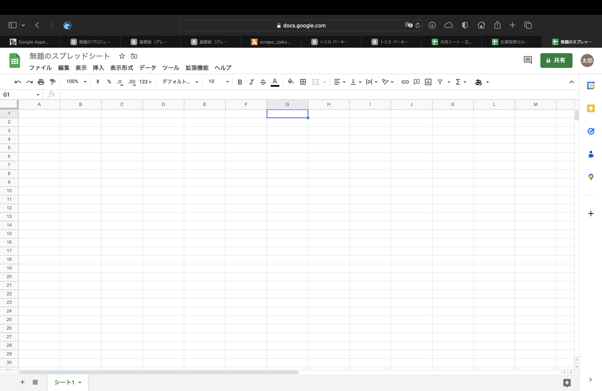


2. 拡張機能からAppsScriptを開く

   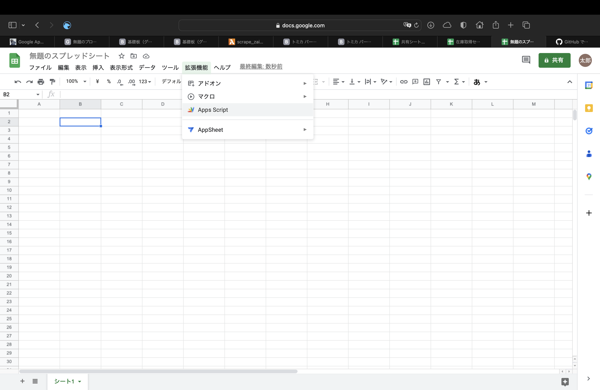


3. ライブラリをクリックする

   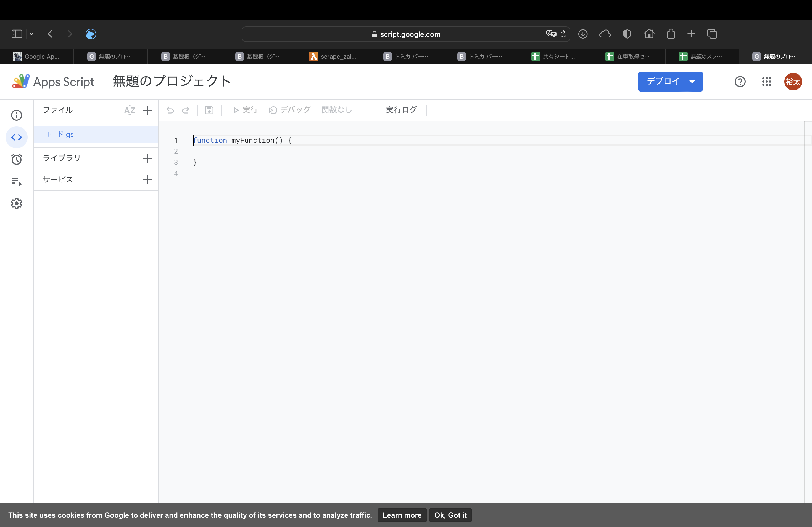

4. 以下のスクリプトIDを入力する

   スクリプトID:1W76oWpJOcc4ABWpqjbo6Mo2cfX7TXg1Q6SpxNYnO359QHeUyQI8L5TkB

   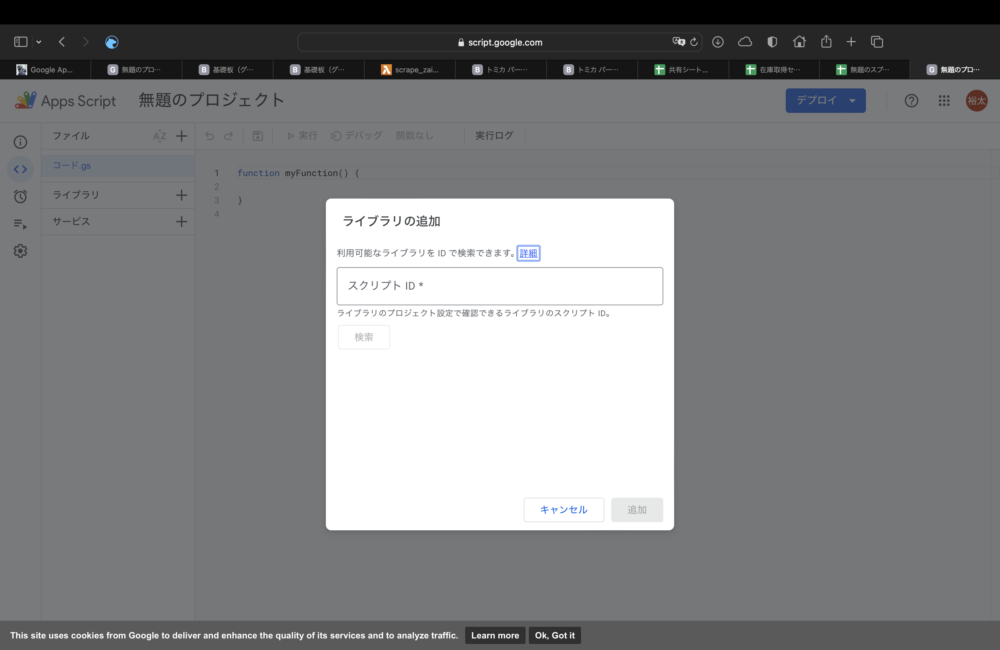

5. 表示された内容を確認しOKを押す

   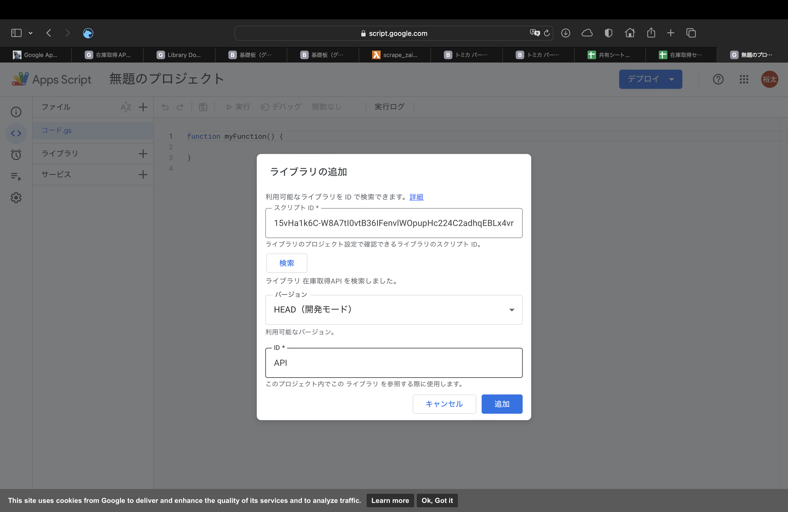

6. コード.gsをクリックし以下のコードを貼り付ける(2023/3/20更新)

   ```
   function FETCHZAIKO(url, path, flag){
     return API.FETCHZAIKO(url,path)
   }
   ```

   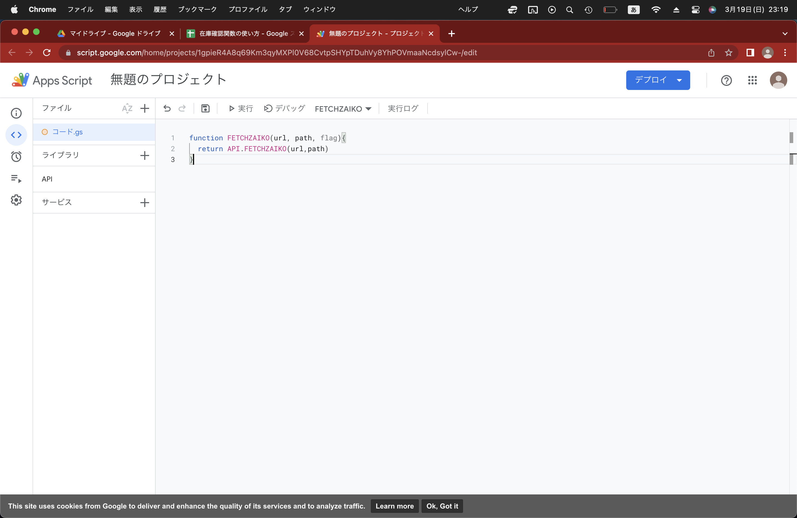


## セル関数使用方法
- 任意のセルに任意の文字を入力しておく（更新用フラグ）
- セル関数(FETCHZAIKO)にURLとPATH、flagを渡すことで在庫数を取得する
> = FETCHZAIKO(URL, PATH, 任意のセル)

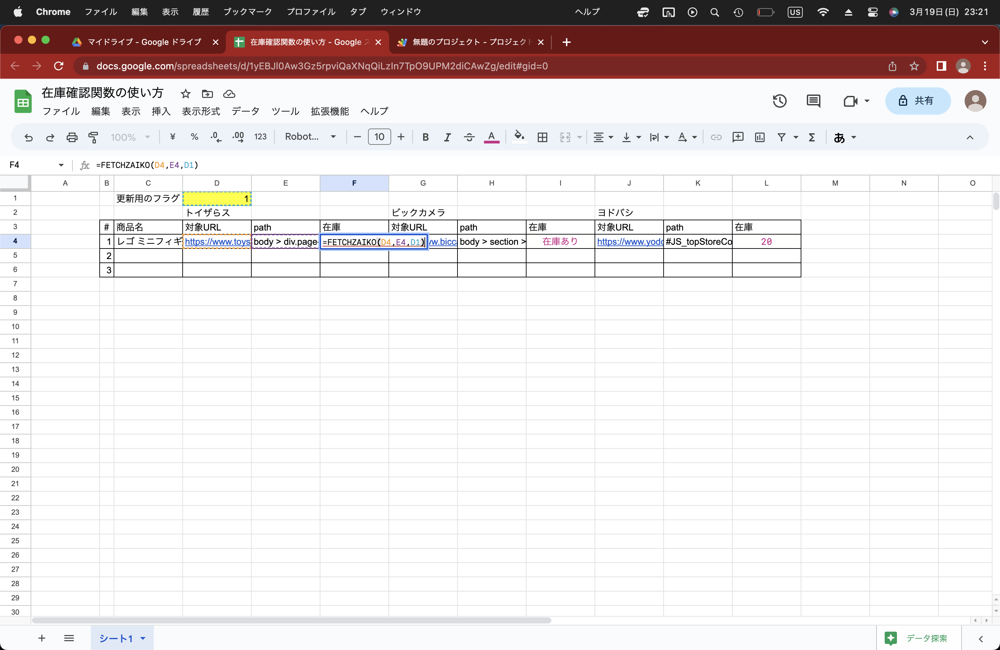

## 更新方法
- 任意のセルに任意の文字を変更することで値が更新される

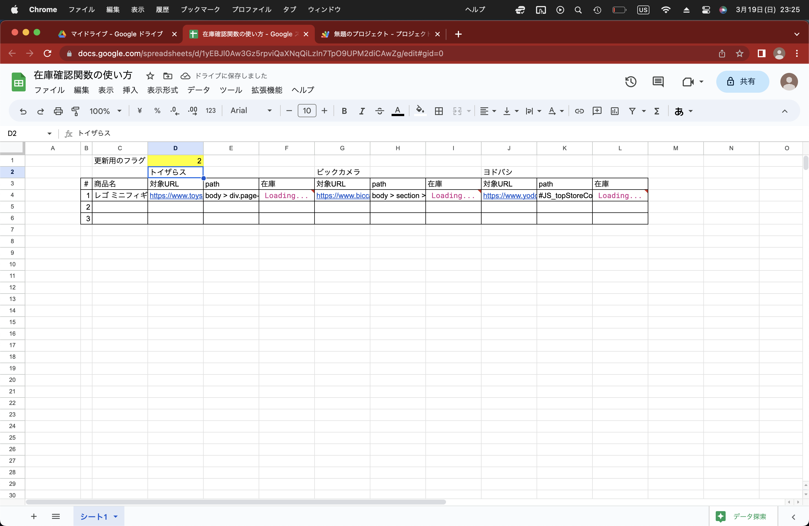

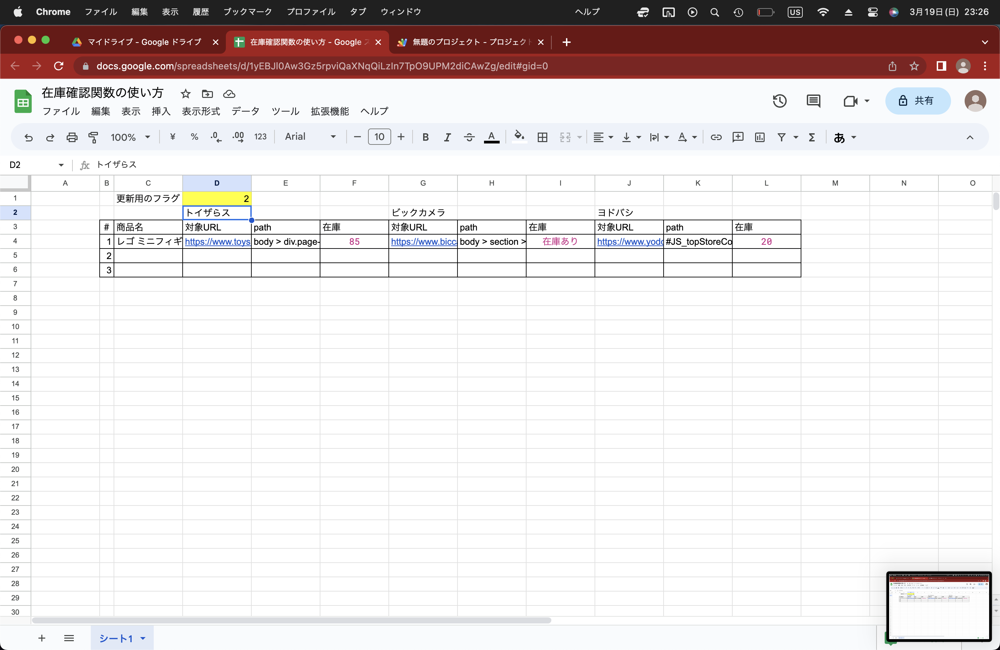


##### １. 在庫を取得したい対象のURLとパスを探してくる

- トイザらスの場合

  - URL

    例）https://www.toysrus.co.jp/s/dsg-732864800

    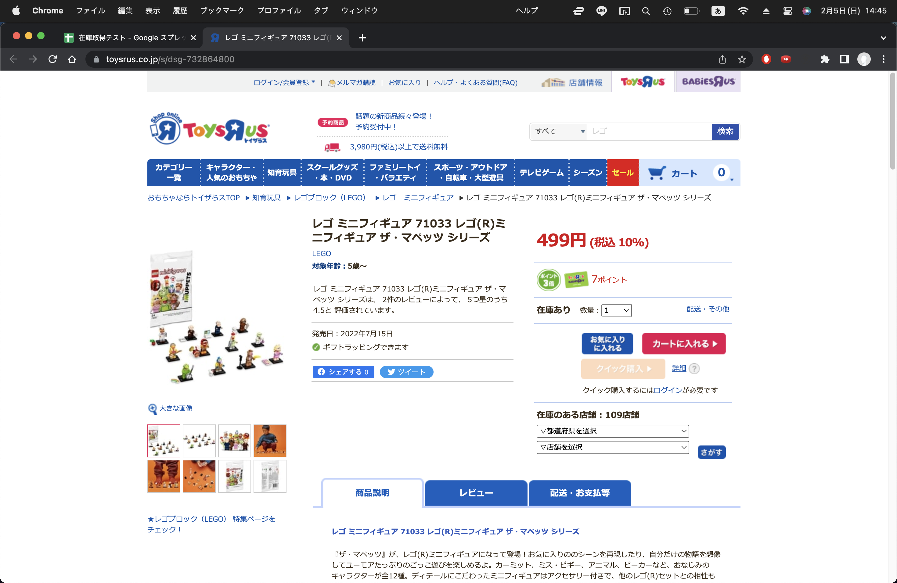

  - PATH

    基本的には以下でOK（取れない場合は以下のパス取得方法を参照）

    > body > div.page-main > div > div.detail > div.detail-primary.cf > form > div > div > div.shopstock.cf > p

- ビックカメラの場合

  - URL

    - 画面右の店舗に取り置くのリンクをクリック

    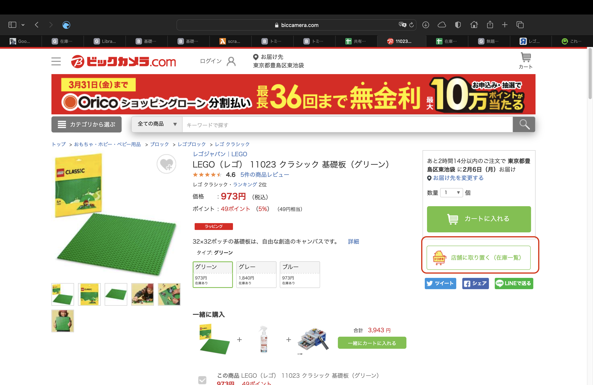

    - 以下のページのURLを取得

    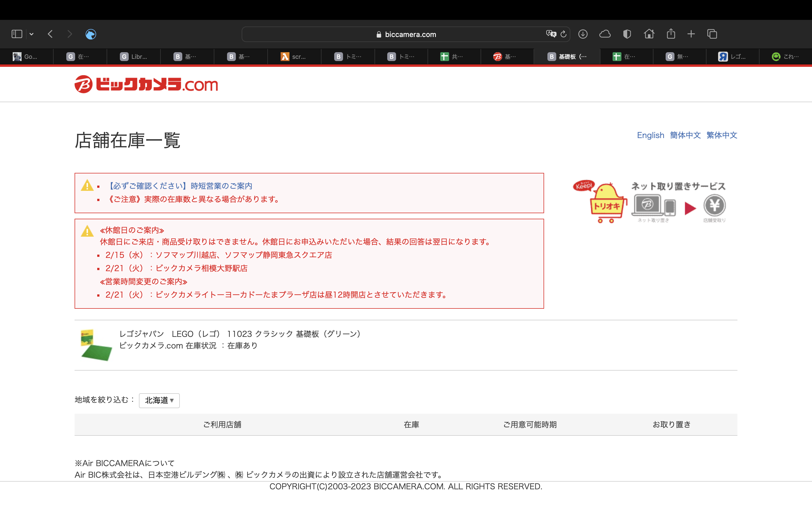

  - PATH

    基本的には以下でOK

    > body > section > a > div

- ヨドバシの場合

  - URL

   例）https://www.yodobashi.com/product/100000001006819597/

    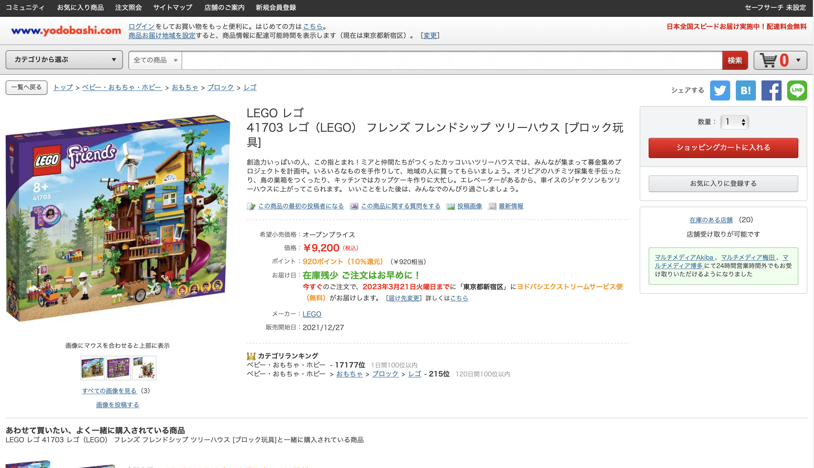

  - PATH

    基本的には以下でOK（取れない場合は以下のパス取得方法を参照）

    > #JS_topStoreCount

2. 以下を参考にセル関数にURLとパスを引き渡す

   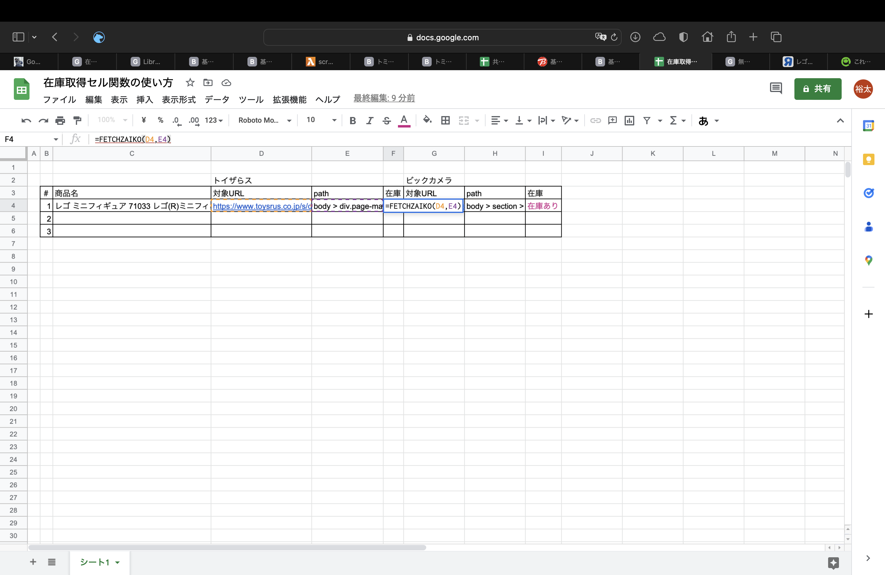


## その他

##### 対応しているサイト（20230320時点）

- トイザらス
- ビックカメラ
- ヨドバシ（3/20対応）
